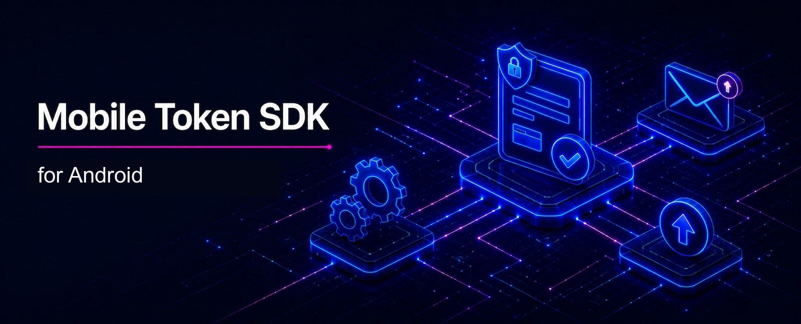

# Wultra Mobile Token SDK for Android

<!-- begin remove -->

__Wultra Mobile Token SDK__ is a high-level SDK for operation approval.
<!-- end -->

## Introduction

With Wultra Mobile Token (WMT) SDK, you can integrate an out-of-band operation approval into an existing mobile app, instead of using a standalone mobile token application. WMT is built on top of [PowerAuth Mobile SDK](https://github.com/wultra/powerauth-mobile-sdk). It communicates with the [Mobile Token API](https://developers.wultra.com/components/enrollment-server/develop/documentation/Mobile-Token-API).

To understand the Wultra Mobile Token SDK purpose on a business level better, you can visit our own [Mobile Token application](https://www.wultra.com/mobile-token). We use Wultra Mobile Token SDK in our mobile token application as well.

WMT SDK library:

- [Retrieves, approves, or rejects operations pending approval for a given user.](docs/Using-Operations-Service.md)
- [Claims anonymous operations.](docs/Using-Operations-Service.md#claim-the-operation)
- [Retrieves operation history.](docs/Using-Operations-Service.md#operation-history)
- [Supports offline authorization.](docs/Using-Operations-Service.md#off-line-authorization)
- [Registers an existing PowerAuth activation to receive push notifications.](docs/Using-Push-Service.md)
- [Manages user's inbox messages.](docs/Using-Inbox-Service.md)
- [Handles OpenID Connect (OIDC) authentication flows.](docs/Using-OIDC-Service.md)
- [And more.](docs)

> [!NOTE]
> - This library does not contain any UI.
> - We also provide an [iOS](https://github.com/wultra/mtoken-sdk-ios), [Flutter](https://github.com/wultra/mtoken-sdk-flutter), and [React Native/Cordova](https://github.com/wultra/mtoken-sdk-js) versions of this library.

## Documentation

The documentation is available at the [Wultra Developer Portal](https://developers.wultra.com/components/mtoken-sdk-android) or inside the [docs folder](docs).

## License

All sources are licensed using the Apache 2.0 license. You can use them with no restrictions. If you are using this library, please let us know. We will be happy to share and promote your project.

## Contact

If you need any assistance, do not hesitate to drop us a line at [hello@wultra.com](mailto:hello@wultra.com) or our official [wultra.com/discord](https://wultra.com/discord) channel.

### Security Disclosure

If you believe you have identified a security vulnerability with Wultra Mobile Token SDK, you should report it as soon as possible via email to [support@wultra.com](mailto:support@wultra.com). Please do not post it to a public issue tracker.
